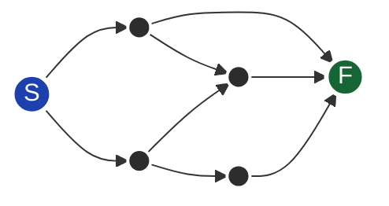
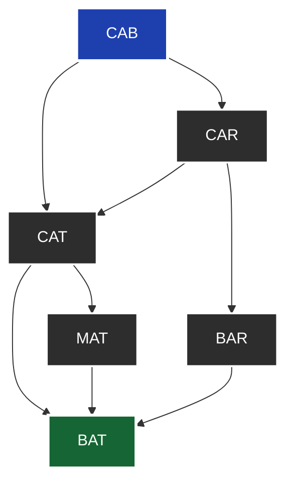
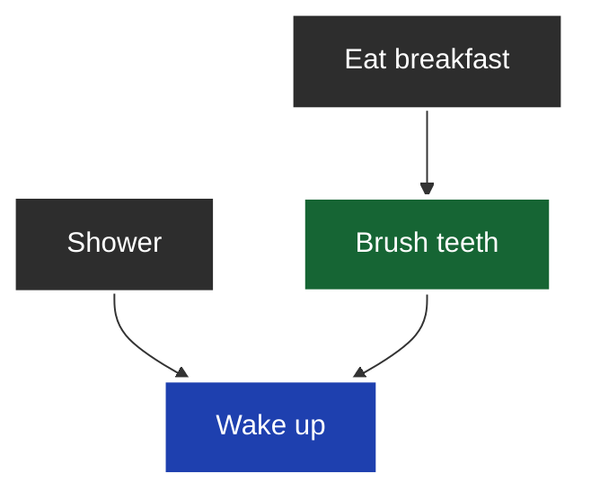
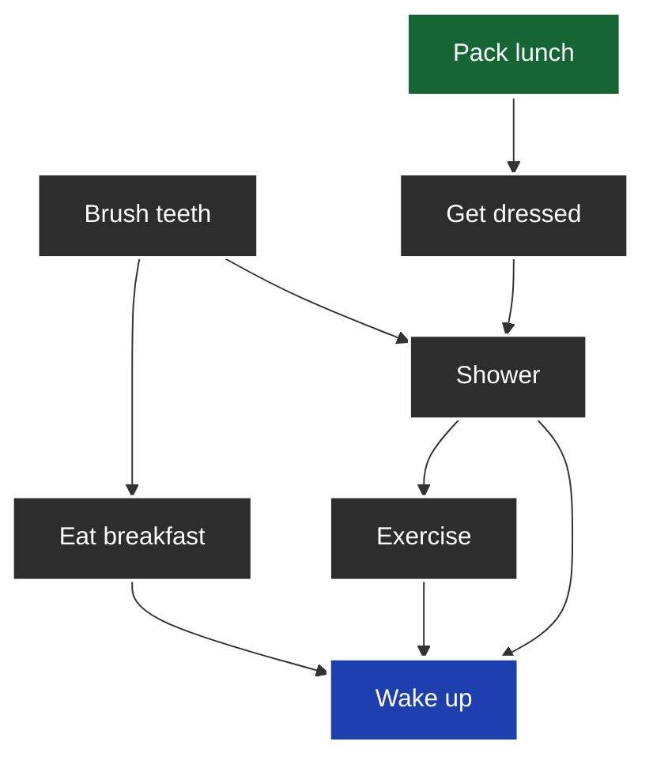

# Chapter 6 - Breadth-first search

## Part 1

Run the breadth-first search algorithm on each of these graphs to find the solution.

### 6.1

Find the length of the shortest path from start to finish.



*Answer*: The shortest path has a length of 2.

## 6.2

Find the length of the shortest path from “cab” to “bat”.



*Answer*: The shortest path has a length of 2.

## Part 2

Here’s a small graph of my morning routine.



It tells you that I can’t eat breakfast until I’ve brushed my teeth. So “eat breakfast” depends on “brush teeth.”

On the other hand, showering doesn’t depend on brushing my teeth because I can shower before I brush my teeth. From this
graph, you can make a list of the order in which I need to do my morning routine:

1. Wake up.
2. Shower.
3. Brush teeth.
4. Eat breakfast.

Note that “shower” can be moved around, so this list is also valid:

1. Wake up.
2. Brush teeth.
3. Shower.
4. Eat breakfast.

## 6.3

For these three lists, mark whether each one is valid or invalid.

A.

1. Wake Up
2. Shower
3. Eat breakfast
4. Brush Teeth

B.

1. Wake Up
2. Brush Teeth
3. Eat breakfast
4. Shower

C.

1. Shower
2. Wake Up
3. Brush Teeth
4. Eat breakfast

*Answer*: A—Invalid; B—Valid; C—Invalid.

## 6.4

Here’s a larger graph. Make a valid list for this graph.



*Answer*: 1—Wake up; 2—Exercise; 3—Shower; 4—Brush teeth; 5—Get dressed; 6—Pack lunch; 7—Eat breakfast.

You could say that this list is sorted, in a way. If task A depends on task B, task A shows up later in the list. This
is called a topological sort, and it’s a way to make an ordered list out of a graph. Suppose you’re planning a wedding
and have a large graph full of tasks to do, and you’re not sure where to start. You could topologically sort the graph
and get a list of tasks to do in order.

# 6.5

What of the following graphs are also trees?

A.

```text
      ( )
     /   \
   [ ]   ( )
  /   \
( )   ( )
```

B.

```text
     ( ) <---.
    /   \    |
  [ ]   [ ]--'
   ^    /  \
   '--[ ]  ( )
```

C.

```text
     ( )
     /
   ( )
     \
     ( ) --> ( )
```

*Answer*: A—Tree; B—Not a tree; C—Tree. The last example is just a sideways tree. Trees are a subset of graphs. So a
tree is always a graph, but a graph may or may not be a tree.